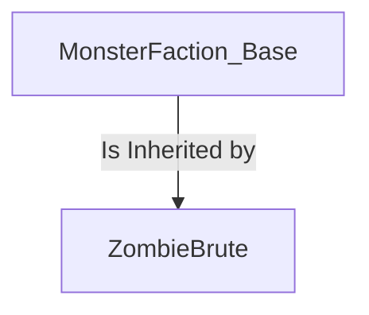
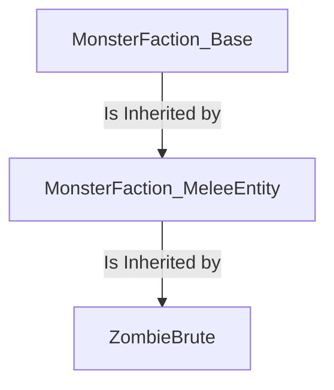
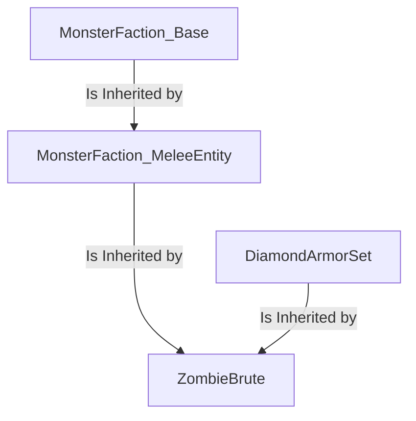

Templates are a functionality that allows a mob to "inherit" the characteristics of one or more other mobs.

If you are already familiar with Object Oriented Programming, you will then probably find the following quite similar to the concept of Inheritance.

But regardless, Template may still be found to be quite complicated to understand at first. As such, we will be adding more nuanche to the concept as we go on explaining it, starting from the very basics and gettings to the more complex use cases.

[[_TOC_]]

## Introduction
As already stated, Templates allows a mob to inherit the characteristics of another. But what does this even mean?

To explain it in simpler terms, we will present, as an example, a mob:
```yaml
ZombieBrute:
  Type: ZOMBIE
  Display: "&2Zombie Brute &7[Lv. <caster.level>]&r"
  Health: 30
  Damage: 5
  Faction: Monster
  Equipment:
  - Iron_Helmet HEAD
  - Iron_Chestplate CHEST
  - Iron_Leggings LEGS
  - Iron_Boots FEET
  - Shield OFFHAND
  Drops:
  - exp 10-15 1
  - rotten_flesh 1-2 1
  - ZombieBrute_Hearth 1 0.01
  Options:
AlwaysShowName: true
PreventOtherDrops: true
PreventRandomEquipment: true
PreventSunburn: true
PreventItemPickup: true
PreventJockeyMounts: true
PreventTransformation: true
  AITargetSelectors:
  - clear
  - attacker
  - players
  AIGoalSelectors:
  - clear
  - meleeattack
  - randomstroll
  DamageModifiers:
  - PROJECTILE 1.15
  - ENTITY_ATTACK 0.75
  KillMessages:
  - '<target.name> was reduced to paste by a <caster.name>'
  - 'Despite his best efforts, <target.name> could not prevail against a <caster.name>'
  - '<target.name> was killed by a <caster.name>'
  Skills:
  - skill{s=SelectRandomWeapon} @self ~onSpawn
  - skill{s=ZombieBrute_Bash} @target ~onTimer:60 0.4 ?targetwithin{d=10}
  - skill{s=CallZombies} @EIR ~onTimer:180 0.6
```
That, while not complex to make, certainly has quite a number of elements associated with it, hasn't he? He's got a Faction, some Drops, some Options...

Now, what if we wanted to create another mob that shares some (if not most!) of the characteristics this mob has? We would normally need to copy-paste what we want from one mob to another, and while that works on the short term, what if we want to later *modify* those characteristics? We would need to track down every instance of them being present on some mob and then change those, one by one. That has no scalability whatsoever!

But here, Templates comes to the rescue: remember what we said originally? They allows to inherit characteristics across mobs, and so, we would need to only make one mob that has all of those common characteristics, and if we want to change some of them at a later date, instead of going mob-by-mob, we could just modify that one mob and see the change being automatically applied to any mob that uses it as a template!

And that brings us to our first, real example of using templates.

## Single Template
Let's say that we want to make a group of mobs share the Factions, the Options, the Ai, some of the Skills and some other element from ZombieBrute. First, we put those elements into a mob
```yaml
MonsterFaction_Base:
  Type: ZOMBIE
  Faction: Monster
  Drops:
  - exp 10-15 1
  Options:
AlwaysShowName: true
PreventOtherDrops: true
PreventRandomEquipment: true
PreventSunburn: true
PreventItemPickup: true
PreventJockeyMounts: true
PreventTransformation: true
  AITargetSelectors:
  - clear
  - attacker
  - players
  AIGoalSelectors:
  - clear
  - meleeattack
  - randomstroll
  DamageModifiers:
  - PROJECTILE 0.75
  - ENTITY_ATTACK 0.75
  KillMessages:
  - '<target.name> was killed by a <caster.name>'
  Skills:
  - skill{s=SelectRandomWeapon} @self ~onSpawn
```
And once we do that, let's make the (now slimmer) ZombieBrute inherit those
```yaml
ZombieBrute:
  Template: MonsterFaction_Base
  Display: "&2Zombie Brute &7[Lv. <caster.level>]&r"
  Health: 30
  Damage: 5
  Equipment:
  - Iron_Helmet HEAD
  - Iron_Chestplate CHEST
  - Iron_Leggings LEGS
  - Iron_Boots FEET
  - Shield OFFHAND
  Drops:
  - rotten_flesh 1-2 1
  - ZombieBrute_Hearth 1 0.01
  DamageModifiers:
  - PROJECTILE 1.15
  KillMessages:
  - '<target.name> was reduced to paste by a <caster.name>'
  - 'Despite his best efforts, <target.name> could not prevail against a <caster.name>'
  Skills:
  - skill{s=ZombieBrute_Bash} @target ~onTimer:60 0.4 ?targetwithin{d=10}
  - skill{s=CallZombies} @EIR ~onTimer:180 0.6
```
And there! With just a simple line, `Template: MonsterFaction_Base`, is now being Inherited by `ZombieBrute`, with any elements contained in `MonsterFaction_Base` now being automatically inherited by `ZombieBrute`



But what about elements that are present on both the mob and its template?

## Shared Elements
When both the Mob and its Template share some elements, one of the following three things happens:
  * The element of the template is overridden by the one in the Mob. (**Overriden**)
* Example: both `MonsterFaction_Base` and `ZombieBrute` have a `PROJECTILE` DamageModifier, so the one in `ZombieBrute` overrides the one in the Template, and is the one that is ultimately applied
  * The element of the Template is added alongside the one of the Mob. (**Partially Overriden**)
* Example: Since the Mob has no `Faction` element, it will inherit the one in the Template, ultimately  being considered as part of the `Monsters` faction
* Example: both `MonsterFaction_Base` and `ZombieBrute` have a DamageModifiers element, with the Template's having `PROJECTILE` and `ENTITY_ATTACK`, while the Mob has only `PROJECTILE`. Since no `ENTITY_ATTACK` DamageModifier is specified in the Mob, the Template's gets inherited, so in the end the `ZombieBrute` mob will take 75% of the damage it would normally take from the `ENTITY_ATTACK` damage source, despite not having that DamageModifier itself
  * The elements of the Mob and of the Template are applied simultaneously, if the elements are part of a list. (**Merged**)
* Example: `Skills` and `KillMessages` are both a list of mechanics and messagges respectively, so you can add them to both the Template and the Mob and expect to see all of them to be present on the Mob
* `AIGoalSelectors` and `AITargetSelectors` are, too, considered a list, so by adding more of them on the Mob, more Selectors are being added at the end of the list, essentially becoming other Selectors but with less importance than the ones in the Template, since Selectors that are placed lower on the list are followed only the one ones above them cannot be.
  * To clear the Selectors of the Template, just use the `clear` Selector

To make this more understandable, the following is a list of all of the elements a Template may have and how the Mob will treat them if the Mob has them too

| **Element** *(in the Template)*   | **How it is inherited** *(if the Mob has it too)*  |
|---------------------------------------|----------------------------------------------------------------| 
| Type | Overriden |
| Display  | Overriden |
| Health   | Overriden |
| Damage   | Overriden |
| Armor| Overriden |
| Bossbar  | Overriden |
| Faction  | Overriden |
| Mount| Overriden |
| Options  | Partially Overriden (only the shared options are overriden)|   
| Modules  | Partially Overriden (only the shared modules are overriden)|
| AIGoalSelectors   | Merged*   |
| AITargetSelectors | Merged*   |
| Drops| Merged|
| DamageModifiers   | Partially Overriden (only the shared modifiers are overriden)  |
| Equipment| Partially Overriden (only equipment with the same slot is overriden)|
| KillMessages  | Merged|
| LevelModifiers| Partially Overriden (only the shared modifiers are overriden)  |
| Disguise | Overriden |
| Skills   | Merged|
| Trades   | Partially Overriden (only trades with the same number are overriden)|


\* A special note must be made regarding the behavior of the AIGoalsSelector and the AITargetSelectors elements, as only stating that they are "merged" is a bit reductive. The selector of the Mob are, in fact, added to the end of the Template's. So, for instance, if the Template has a `clear`,`meleeattack` AIGoals and the Mob has a `randomstroll` one, the final mob will effectively have `clear`,`meleeattack`,`randomstroll` as its AIGoals.
If one wishes to reset the Selectors from the Template, one can either use the [`Exclude`](#excluding-elements) element or use the `clear` Selector, as that will "delete" every Selector that came before it.

## Excluding Elements
It is possible to stop a Mob from inheriting unwanted elements from its Template using the following syntax
```yaml
  Exclude:
  - Element1
  - Element2
  - {...}
```

So, for instance, if we wanted a mob to not inherit the Equipment, the AITargetSelectors and the Skills, we would be using

```yaml
ExampleMob:
  Template: MobTemplate
  Exclude:
  - Equipment
  - AITargetSelectors
  - Skills
```
And the mob will now not inherit the specified elements.

## Chained Templates
But why should we stop at only one Template? After all, Templates can have a Template, too! Let's revisit out example from earlier, but this time splitting it up a little bit more

```yaml
MonsterFaction_Base:
  Type: ZOMBIE
  Faction: Monster
  Drops:
  - exp 10-15 1
  Options:
AlwaysShowName: true
PreventOtherDrops: true
PreventRandomEquipment: true
PreventSunburn: true
PreventItemPickup: true
PreventJockeyMounts: true
PreventTransformation: true
  DamageModifiers:
  - PROJECTILE 0.75
  - ENTITY_ATTACK 0.75
  KillMessages:
  - '<target.name> was killed by a <caster.name>'
```

```yaml
MonsterFaction_MeleeEntity:
  Template: MonsterFaction_Base
  Equipment:
  - Iron_Helmet HEAD
  - Iron_Chestplate CHEST
  - Iron_Leggings LEGS
  - Iron_Boots FEET
  - Shield OFFHAND
  AITargetSelectors:
  - clear
  - attacker
  - players
  AIGoalSelectors:
  - clear
  - meleeattack
  - randomstroll
  Skills:
  - skill{s=SelectRandomWeapon} @self ~onSpawn

```

```yaml
ZombieBrute:
  Template: MonsterFaction_MeleeEntity
  Display: "&2Zombie Brute &7[Lv. <caster.level>]&r"
  Health: 30
  Damage: 5
  Drops:
  - rotten_flesh 1-2 1
  - ZombieBrute_Hearth 1 0.01
  DamageModifiers:
  - PROJECTILE 1.15
  KillMessages:
  - '<target.name> was reduced to paste by a <caster.name>'
  - 'Despite his best efforts, <target.name> could not prevail against a <caster.name>'
  Skills:
  - skill{s=ZombieBrute_Bash} @target ~onTimer:60 0.4 ?targetwithin{d=10}
  - skill{s=CallZombies} @EIR ~onTimer:180 0.6
```

This way, we have created a new mob, `MonsterFaction_MeleeEntity`, that is using `MonsterFaction_Base` as a Template.

And with `ZombieBrute` using `MonsterFaction_MeleeEntity` as a Template, it does not inherit the only elements of `MonsterFaction_MeleeEntity`, but also those that `MonsterFaction_MeleeEntity` itself inherited up to that point.



## Multi Templates
Up until now we have shown how to use a single Template inside of a mob, but a mob can use more than one at the same time.

By simply using a list of Templates as the Template argument, we can make the mob inherit one template after another **from the leftmost on the list to the rightmost**. Simply said, by making a list of templates, it's like we are chaining multiple templates together, starting from the leftmost one and ending with the rightmost one.

But let's see an example to make things clear:
```yaml
DiamondArmorSet:
  Type: ZOMBIE
  Equip:
  - Diamond_Helmet HEAD
  - Diamond_Chestplate CHEST
  - Diamond_Leggings LEGS
  - Diamond_Boots FEET
```
This mob does nothing in particular by itself, its only characteristic being the diamond set of armor it has equipped. But if we use it like so:

```yaml
ZombieBrute:
  Template: MonsterFaction_MeleeEntity, DiamondArmorSet
  Display: "&2Zombie Brute &7[Lv. <caster.level>]&r"
  Health: 30
  Damage: 5
  Drops:
  - rotten_flesh 1-2 1
  - ZombieBrute_Hearth 1 0.01
  DamageModifiers:
  - PROJECTILE 1.15
  KillMessages:
  - '<target.name> was reduced to paste by a <caster.name>'
  - 'Despite his best efforts, <target.name> could not prevail against a <caster.name>'
  Skills:
  - skill{s=ZombieBrute_Bash} @target ~onTimer:60 0.4 ?targetwithin{d=10}
  - skill{s=CallZombies} @EIR ~onTimer:180 0.6
```

Then our dear `ZombieBrute` now will spawn with a shiny new set of diamond armor, since the `DiamondArmorSet` Template is overriding some of the equipments present in `MonsterFaction_MeleeEntity`



##