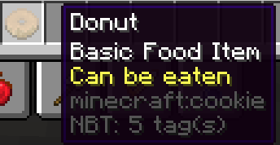

The Donut
--------------
* A cookie example item that uses a resource pack, [Mythic Crucible](https://git.lumine.io/mythiccraft/mythiccrucible), and [CustomModelData](https://mcmodels.net/how-to-tutorials/resource-pack-tutorials/what-is-custommodeldata-2/) to make it look like a donut. When consumed, it gives a short burst of the saturation potion effect and gives a small amount of saturation replenishment.

For info on how the "eatmeal" skill is used, check [here](https://git.lumine.io/mythiccraft/MythicMobs/-/wikis/Consumable-Skills#eat-food-skill).

```yaml
donut:
  Id: COOKIE
  Display: 'Donut'
  Model: 1
  Lore:
  - '&fBasic Food Item'
  - '&eCan be eaten'
  Skills:
  - skill{s=eatmeal} ~onConsume
```

